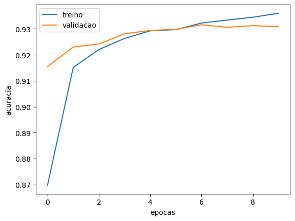

## Aplicação prática de Redes Convolucionais

Ponderada para treinar um modelo de CNN (Convolutional Neural Network) e um modelo linear para classificar imagens de números escritos à mão, utilizando a biblioteca Keras.

## Construção dos modelos

Os modelos foram treinados com o conjunto de dados MNIST, que contém 60.000 imagens de treinamento e 10.000 imagens de teste. Cada imagem tem dimensões de 28x28 pixels.

### Modelo de CNN

Minha rede neural convolucional (CNN) foi baseada na arquitetura LeNet.

Ela começa com duas camadas convolucionais Conv2D com 32 filtros de tamanho 5x5, seguidas por camadas de normalização por lote (BatchNormalization) para estabilizar e acelerar o treinamento. Após a segunda camada convolucional, uma camada de pooling (MaxPooling2D) com janela de 2x2 e uma camada de dropout com taxa de 0.25 são aplicadas para reduzir a dimensionalidade e prevenir overfitting.

A terceira camada convolucional possui 64 filtros de tamanho 5x5 com stride de 2, seguida por uma camada de normalização por lote e outra camada de pooling com janela de 2x2. A saída das camadas convolucionais é achatada (Flatten) e passada para duas camadas densas (Dense) com 512 e 1024 unidades, respectivamente, ambas utilizando a função de ativação ReLU e normalização por lote. Uma camada de dropout com taxa de 0.5 é adicionada após a segunda camada densa para regularização.

Finalmente, a camada de saída (Dense) possui 10 unidades com a função de ativação softmax, produzindo probabilidades para classificar a imagem em uma das 10 classes.

```python

model = Sequential()
model.add(Conv2D(filters=32, kernel_size=(5,5), padding='same', strides=1, activation='relu', data_format='channels_last', kernel_initializer='he_normal', input_shape=(28, 28, 1)))
model.add(BatchNormalization())
model.add(Conv2D(filters=32, kernel_size=(5,5), padding='same', activation='relu'))
model.add(BatchNormalization())
model.add(MaxPooling2D(pool_size=(2, 2), strides=2, padding='valid'))
model.add(BatchNormalization())
model.add(Dropout(0.25))

model.add(Conv2D(filters=64, kernel_size=(5,5), strides=2, padding='same', activation='relu'))
model.add(BatchNormalization())
model.add(MaxPooling2D(pool_size=(2, 2), strides=2, padding='valid'))

model.add(Flatten())
model.add(Dense(512, activation='relu'))
model.add(BatchNormalization())
model.add(Dense(1024, activation='relu'))
model.add(BatchNormalization())
model.add(Dropout(0.5))
model.add(Dense(10, activation='softmax'))

```

O modelo foi treinado com o otimizador Adam, com função de perda entropia cruzada categórica e com 50 epocas. A acurácia foi utilizada como métrica para avaliar o desempenho do modelo durante o treinamento.

### Modelo linear

A arquitetura inclui apenas uma camada densa com 10 neurônios, cada um correspondendo a uma das classes de saída. A função de ativação softmax é utilizada na camada de saída para produzir uma distribuição de probabilidade sobre as 10 classes, permitindo a classificação da entrada. Este modelo é simples e serve como um ponto de partida básico para tarefas de classificação de imagens.

```python

model = Sequential()
# Criação do modelo linear
model = Sequential()
# Neumronios, ativação, input_shape
model.add(Dense(10, activation='softmax', input_shape=(28*28,)))

```

O modelo foi treinado com o otimizador Adam, com a função media dos erros quadrados e com 10 epocas. A acurácia foi utilizada como métrica para avaliar o desempenho do modelo durante o treinamento.

### Comparação dos modelos

O modelo linear simples consiste em uma única camada densa com 10 neurônios e função de ativação softmax. Ele apresenta um tempo de treinamento muito rápido devido à sua simplicidade e baixa complexidade computacional (Menos de 2 minutos). No entanto, seu desempenho em termos de precisão é geralmente menor, e sua capacidade de generalização é bem limitada. O tempo de inferência desse modelo também é muito rápido devido à sua simplicidade e baixa quantidade de operações necessárias.

Por outro lado, o modelo coolucional tem um tempo de treinamento mais lento devido à maior quantidade de parâmetros e operações computacionais necessárias (aproximademente 40 minutos no TPU do Colab). No entanto, ele geralmente oferece um desempenho melhor em termos de precisão e possui uma melhor capacidade de generalização, sendo capaz de capturar representações mais complexas dos dados. O tempo de inferência é mais lento em comparação ao modelo linear simples devido à maior quantidade de operações envolvidas.

## Rotas backend

## Resumo das Rotas para Classificação de Digitos MNIST

**API:**

* **Rota Principal (/):**
    * GET: Renderiza página inicial (formulário para upload de imagem?).
* **Rota CNN (/predictCNN/):**
    * POST:
        * Recebe imagem via form (campo `image`).
        * Classifica com modelo CNN.
        * Retorna JSON: `predictionCNN` (nome do dígito previsto).
* **Rota Linear (/predictLinear/):**
    * POST:
        * Recebe imagem via form (campo `image`).
        * Classifica com modelo Linear.
        * Retorna JSON: `predictionLinear` (nome do dígito previsto).

* Imagens salvas temporariamente como `image.png`.
* Modelos: `modelo_mnist_cnn_top.h5` e `modelo_mnist_linear.h5`.

## Resultados

O modelo de CNN obteve uma acurácia de 99.81% no conjunto de teste, enquanto o modelo linear obteve uma acurácia de 97.92%.

Segue abaixo os gráficos de acurácia e perda para o modelo de CNN:

Acurácia:


Perda:


Aqui estão os gráficos de acurácia e perda para o modelo linear:

Acurácia:


Perda:


## Como executar

Crie um ambiente virtual e instale as dependências:

```bash
python3 -m venv .venv
source .venv/bin/activate
cd web
pip install -r requirements.txt
```

Execute o servidor:

```bash
python main.py
```

Acesse o endereço `http://localhost:5000` no seu navegador.

Na pasta imgTest estão algumas imagens para teste.

## Demonstração

Acesse o vídeo de demonstração [aqui](https://youtu.be/LFf5j-1du2Y).
